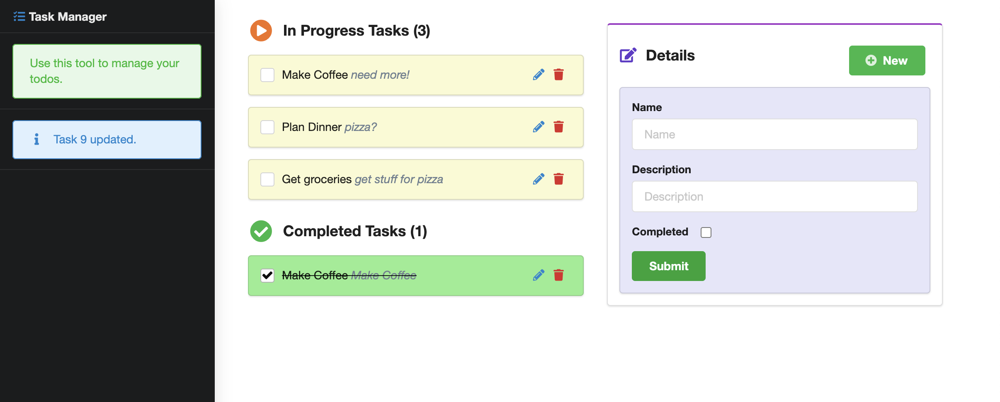

# [TODO App](https://laurie-vue-rails-todo.herokuapp.com)

## [SEE DEMO](https://laurie-vue-rails-todo.herokuapp.com) - on Heroku, takes ~20 seconds to spin up

This simple app takes a Vue2 and Semantic front-end app and adds a Rails back-end to it. A user creates a new task, name and description are required. The task status can be toggled between completed or in progress. A message shows up in the sidebar for each function performed. Deletion is immediate, and without a warning, as that might be irritating in a commonly used app.

If I were to update it, I would add a clear button (currently the new button does this function) and have the new button show the form.

## Technologies Used:

* Rails 6.1.1
* Ruby 3.0.0p0 
* Vue 2.6.12
* Semantic UI 2.4.2
* Axios 0.21.1
* SQLite3 db in dev, PostgreSQL in development

It was built following a code-along by Evgeny Rahman in the [JavaScript and Ruby on Rails with React, Angular, and Vue](https://www.udemy.com/course/ruby-on-rails-react-angular/) course. This course is somewhat dated, but it built on top of projects built in an earlier course, so I figured it'd be good to learn on apps that I had built, and already know.

I ended up wasting a bit of time with this app trying to fix some issues in the original one, but they were fixed when I migrated to this version. 